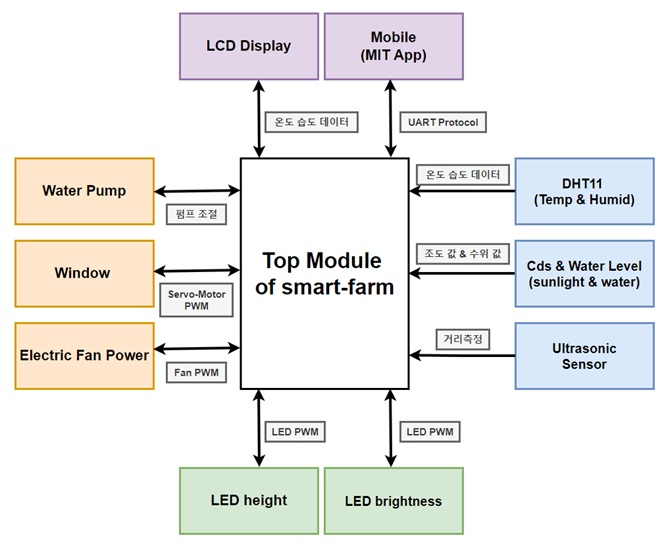
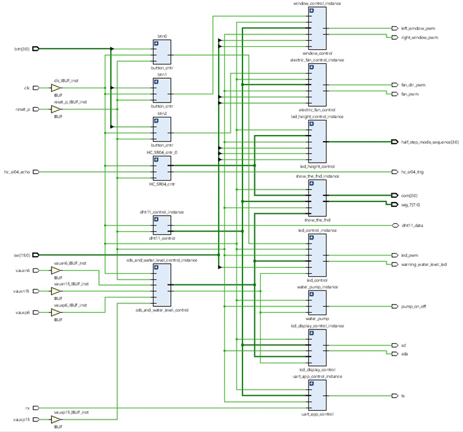

## Team-Project_Smart-Hydroponic-Plant-Grower

### 1. 목적
- 기존 수경재배기의 불편함을 Basys3 FPGA, 각종 센서, 블루투스 통신 등을 통해 해소

### 2. 프로젝트의 목표
- 다양한 센서를 이용한 재배기 자동화 구현
- LCD 모듈을 통한 실시간 온습도 출력 
- 블루투스 모듈, 앱을 통해 온습도 확인

### 3. 동작 모드

  

### 4. Block Diagram

  

### 5. RTL Schematic

  

  

